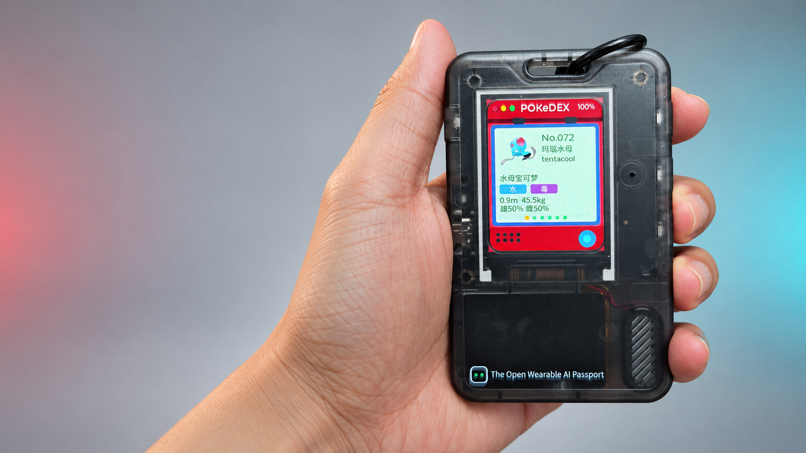
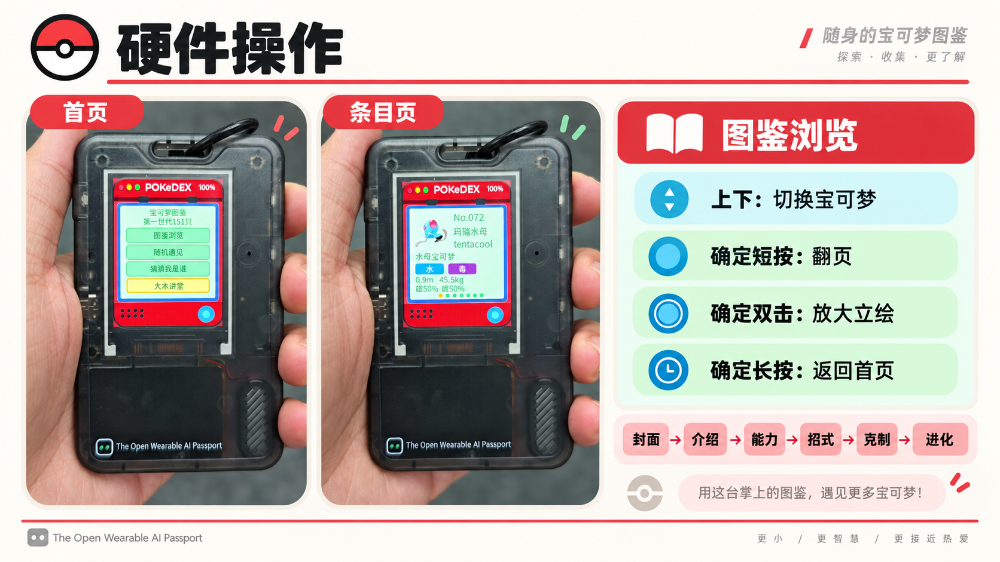

<p align="right">
  <a href="README.zh_CN.md">简体中文</a> · <strong>English</strong>
</p>

# Generation I Pokedex

A wearable Pokedex for [AI Passport](https://ai-passport.folotoy.cn) (ESP32-C3, ESP-IDF 5.5.3). It boots into the original 151: browse in order, pick a random encounter, or read short world facts. Each entry has a sprite, cry, types, height and weight, gender, bio, stats, abilities, level-up moves, matchups, and evolution.

Design, flash budget, and data pipeline: [docs/assets/pokedex/README.md](docs/assets/pokedex/README.md).



The Pokedex is designed for quick, physical browsing: choose a mode from the home screen, use Up / Down to move through the pool, and use OK to move through an entry's pages. The visual guide below shows the interaction model on the real device.



## Flash

Do **not** run `idf.py erase-flash` on a provisioned badge. Do **not** write `build/FoloToy-AI-Passport-full.bin` from `0x0` (that wipes `cardid`).

```bash
export PATH="$HOME/.espressif/python_env/idf5.5_py3.12_env/bin:/opt/homebrew/bin:$PATH"
. "$HOME/esp/esp-idf-v5.5.3/export.sh"
idf.py flash
```

That writes bootloader, partition table, app, and `pokedexfs` at `0x35A000`. It skips `cardid` and Recovery. If `assets/pokedex/fs/` has no packed sprites or cries, run `python3 tools/pokedex/build_media.py` first.

## Controls

| Key | Home | In an entry |
| --- | --- | --- |
| Up / Down | Move the menu | Previous / next Pokemon (on Matchup, scroll first) |
| OK click | Open the selected item | Next page: Cover, Bio, Stats, Moves, Matchup, Evolution. While zoomed, restores Cover |
| OK double | — | On Cover, 3x fullscreen sprite |
| OK long-press | Open volume and backlight | Back to Pokedex home (replays the cry when leaving Cover) |

Facts: Up / Down (or OK click) steps the pool; OK long-press returns home. Settings: OK switches volume/backlight, Up/Down change the value, long-press returns; values persist.

## Fan-work notice

Personal, non-commercial fan play. Pokemon names, characters, artwork, cries, and Pokedex text belong to Nintendo, The Pokemon Company, and Game Freak. Catalog data comes from [PokeAPI](https://pokeapi.co); cries from [PokeAPI/cries](https://github.com/PokeAPI/cries).
